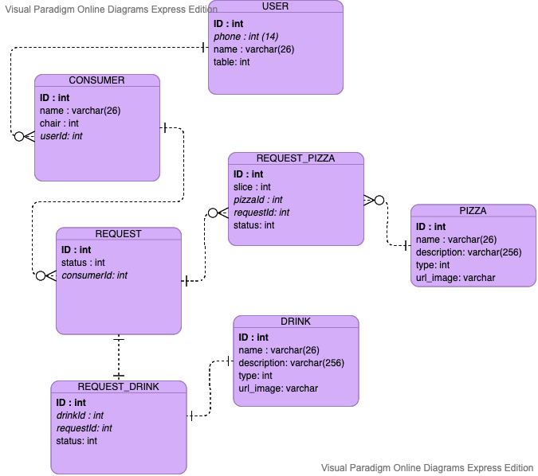

<div align="center">
  <h1>
    :pizza: <i>RodiEasy - Desafio SEBRAE</i>
  </h1>
  <p>
Esta API foi desenvolvida durante o [MegaHack](http://megahack.com.br/) para o desafio SEBRAE cujo objetivo era a criação de soluções para reconsquistar o consumidor de serviços de alimentação pós/durante a pandemia.
</p>

  <div>
    
    
    <a href="https://www.linkedin.com/in/anajuliabit/">
      
    </a>
    <a href="https://github.com/anajuliabit/megahack-sebrae-backend/commits/master">
      
    </a>
  </div>
</div>

## :computer: Tecnologias

- [Node](https://nodejs.org/en/)
- [Nest.js](https://nestjs.com/)
- [TypeORM](https://typeorm.io/#/)
- [Graphql](https://graphql.org/)

## :floppy_disk: Modelagem do banco de dados



## :sparkles: Features

1. Cadastro de sessão contendo nome, telefone e mesa do usuário.
2. Possibilidade de adicionar, remover, listar e encontrar acompanhante.
3. Procurar, cadastras, remover e listar pizza.
4. Filtro de pizza com as seguintes possibilidades:
   - Tipo: salgada, doce, vegetariana e especial.
   - Status: no forno, pronta, próxima e aguardando.

## :wrench: Instalação

```bash
$ npm install
```

## :sparkles: Rodando o projeto

```bash
# production mode
$ npm run start

# development mode
$ npm run start:dev

```

A aplicação ficará disponível em: [http://localhost:3000](http://localhost:3000)

## :pushpin: Melhorias

- [ ] Alterar para postgres ou algum outro banco SQL ao invés de utilizar SQLite.
- [ ] Criar containers com docker para rodar a aplicação e levantar o banco de dados.
- [ ] Apenas usuários com a permissão de admin poderem fazer transação na tabela de pizzas.
- [ ] Implementar testes.
